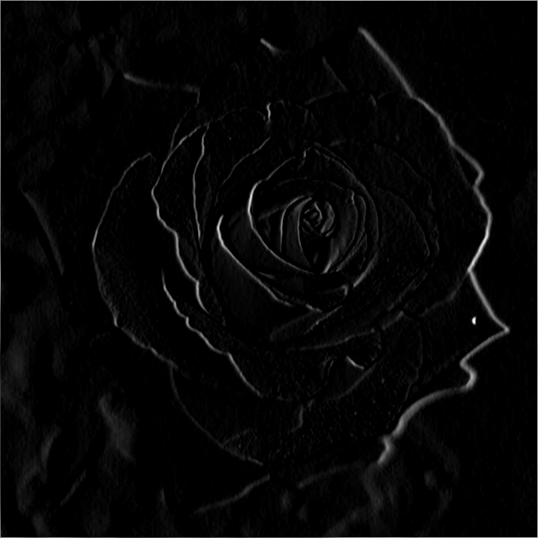
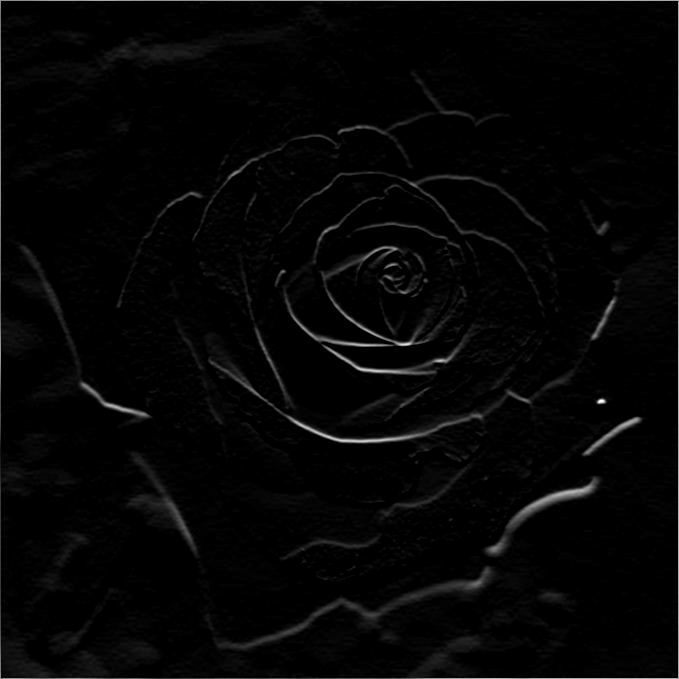
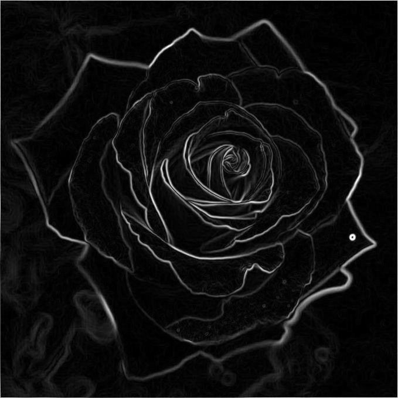
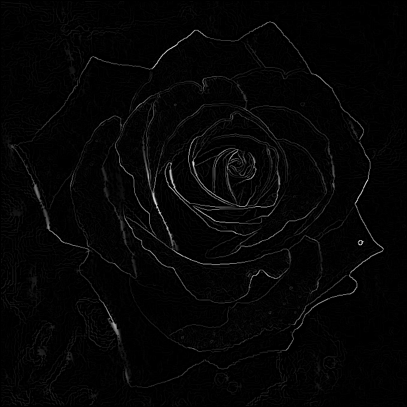
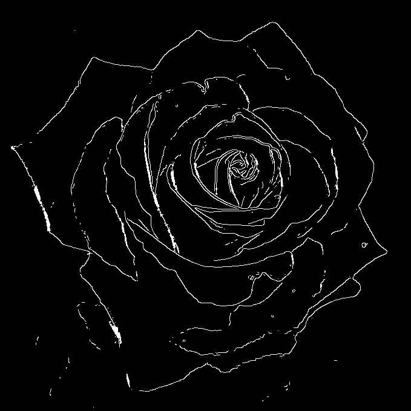
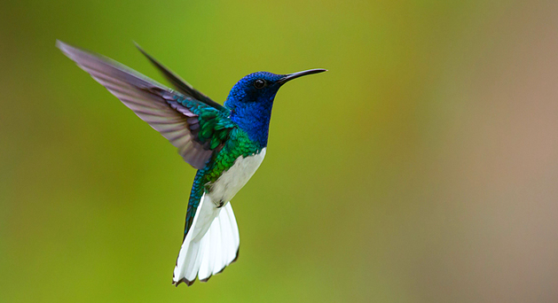
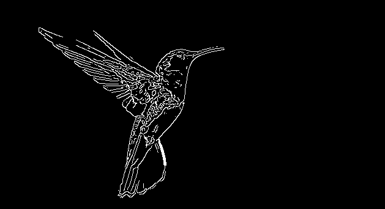
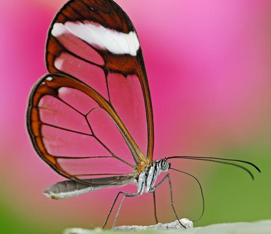
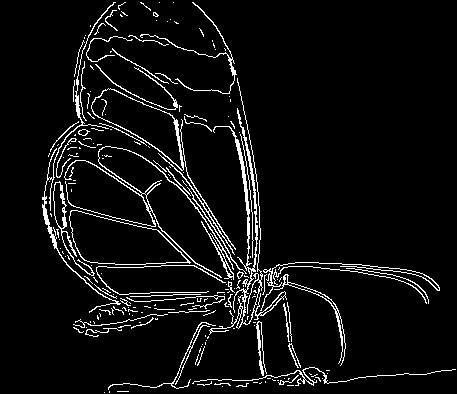
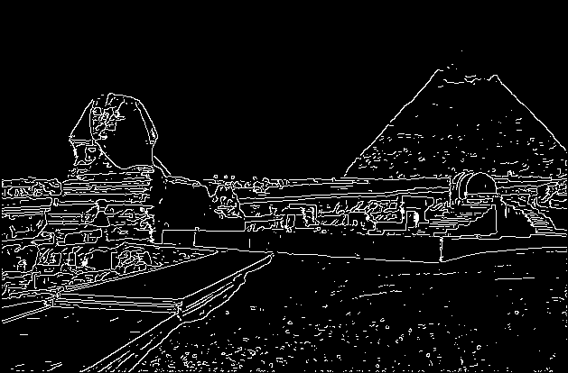

# Canny Edge Detector

The Canny Edge Detector is an algorithm used to perform edge detection in image processing. This repository contains an implementation in Python.

## Usage

Run `python src/main.py <image-name> <low-threshold?> <high-threshold?>` to execute the algorithm, where:

- `<image-name>` is the input image (that must be contained in `input/` directory);
- `<low-threshold?>` and `<high-threshold?>` are the low and high thresholds to be used in hysteresis threshold step. These parameters are optional and their default values in the implementation are `20` and `40`, respectively. Note: if only the low threshold is provided, the high threshold will be the double of it.

The output images will be stored in `output/` directory, which are:

- `_output-step-1.png`: grayscale smoothed/blurred image, obtained using Gaussian kernel;
- `_output-step-2.png`: horizontal gradient of the image, obtained using Sobel kernel;
- `_output-step-3.png`: vertical gradient of the image, obtained using Sobel kernel;
- `_output-step-4.png`: gradient magnitude of the image, obtained using Pythagorean Theorem;
- `_output-step-5.png`: non-maximum suppressed image;
- `output-detected-edges.png`: **the actual result image**, which is obtained from the application of the hysteresis thresholding on the non-maximum suppressed image.

## Examples

### Flower Image

1. Input:   
2. Smoothed:   
3. Horizontal gradient:   
4. Vertical gradient:   
5. Gradient magnitude:   
6. Non-maximum suppressed:   
7. **[Result]** Hysteresis thresholding:   

### Bird Image

1. Before:   
2. After:   

### Butterfly Image

1. Before:   
2. After:   

### Egypt Image

1. Before:   
2. After:   

## License

This project is licensed under the [MIT License](./LICENSE).
